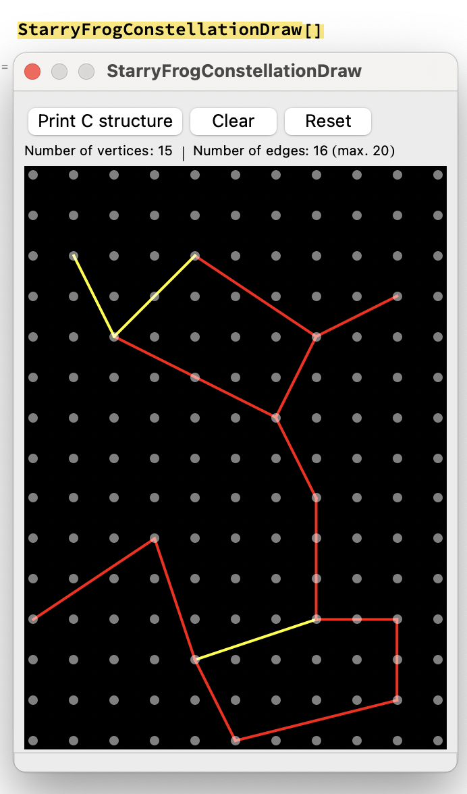

## Starry Frog


### Description

Help a frog connect the stars to create marvelous constellations!

As the starry frog, your mission is to grab, move and connect stars to form constellations.
However, not all stars will be able to form a bridge.
Have a look at the minimap to pinpoint the locatation of valid star bridges in the constellation.

This game was heavily inspired (if not completely) by a minigame in [MapleStory](https://maplestory.nexon.net/): [Star Bridge](https://maplestory.nexon.net/news/77917/v-237-ignition-cygnus-knights-redux-patch-notes/#Star).

### Features

 - Custom sprites
 - 256x256 pixels
 - Fun!
 - Pure C and Raylib (no external libraries)

### Controls

Keyboard:
 - Arrow keys for movement
 - Space bar for grabbing/releasing stars
 - (Left) shift key for movement boost
 - Press 1/2/3 to adjust screen scaling

### Screenshots


### Developers

 - Daniel Sanchez - Programmer + Game Artist

### Links

 - itch.io Release: https://daneelsan.itch.io/starryfrog

### Resources

 - Color palette: [OIL 6 PALETTE](https://lospec.com/palette-list/oil-6)
 - Font: [Autriche Font](https://www.fontspace.com/autriche-font-f3285)
 - Sprite Editor: [Piskel](https://www.piskelapp.com/)


### Tools

For drawing the maps of the constellations used in the game, I quickly prototyped a map editor in [Wolfram Language](https://www.wolfram.com/language/):

 

This is why you'll see that Mathematica is being used as part of this project (found in [StarBridgeTools.nb](tools/StarryFrogTools.wl)).

To use it, simply run the following snippet in a Wolfram Language notebook:
```Mathematica
Get["~/git/StarBridge/tools/StarryFrogTools.wl"];
StarryFrogConstellationDraw[]
```

### License

This game sources are licensed under an unmodified zlib/libpng license, which is an OSI-certified, BSD-like license that allows static linking with closed source software. Check [LICENSE](LICENSE) for further details.

*Copyright (c) 2022 Daniel Sanchez (daneelsan)*
